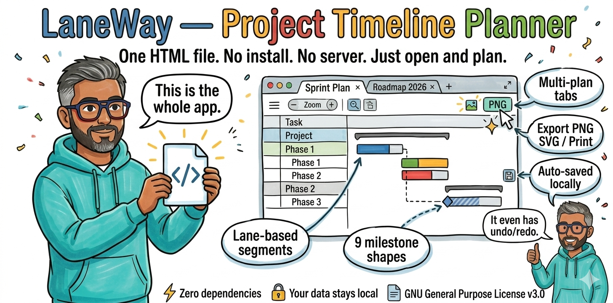

# LaneWay — Project Timeline Planner

> A fully-featured, browser-native Gantt chart and project timeline tool. **Zero dependencies to install. No server. No build step. One HTML file.**



---

## Table of Contents

- [What is LaneWay?](#what-is-laneway)
- [Quick Start](#quick-start)
- [Features](#features)
  - [Multi-Plan Tabs](#multi-plan-tabs)
  - [Projects, Phases & Segments](#projects-phases--segments)
  - [Milestones](#milestones)
  - [Zoom & Navigation](#zoom--navigation)
  - [Column Resizing](#column-resizing)
  - [Business Days Mode](#business-days-mode)
  - [Export & Import](#export--import)
  - [Image Export & Print](#image-export--print)
  - [Stats Bar](#stats-bar)
  - [Theme Toggle](#theme-toggle)
  - [Keyboard Shortcuts](#keyboard-shortcuts)
- [Data Model](#data-model)
- [Storage Architecture](#storage-architecture)
- [Technical Architecture](#technical-architecture)
- [Self-Hosting](#self-hosting)
- [Contributing](#contributing)
- [Roadmap](#roadmap)
- [License](#license)

---

## What is LaneWay?

LaneWay is a **single HTML file** that you open in any modern browser to plan, visualise, and share project timelines. It works entirely offline. There is nothing to install, no account to create, no server to run.

It is designed for:

- **Product and engineering teams** planning quarterly roadmaps
- **Project managers** tracking multi-phase delivery plans
- **Individuals** who want a fast, keyboard-friendly Gantt chart without the overhead of enterprise tools

Everything is saved automatically to your browser's local storage. Plans can be exported as JSON for backup and sharing, and as PNG or SVG images for documents and presentations.

---

## Quick Start

1. **Download** `project_timeline_v8.5.html` (or the latest version)
2. **Open it** in Chrome, Firefox, Edge or Safari — double-click the file, or drag it into a browser tab
3. **Start planning** — two example plans are pre-loaded across two tabs to help you explore the interface

That's it. No npm, no webpack, no Docker.

---

## Features

### Multi-Plan Tabs

LaneWay supports multiple independent plans in a single browser session, each on its own tab.

| Action | How |
|---|---|
| Create a new tab | Click **＋** at the end of the tab bar, or **☰ → New tab** |
| Rename a tab | Double-click the tab label, type a new name, press Enter |
| Duplicate a tab | **☰ → Duplicate tab** — copies the current plan to a new tab |
| Close a tab | Click **×** on the tab (disabled when only one tab remains) |
| Move a project to another tab | Click **⇄** on any project row, or open the project drawer and scroll to the *Move or copy* section |

Each tab maintains its own:
- Start month and duration (number of months shown)
- Zoom level and per-month column widths
- Row heights, bar heights, header band heights
- All projects, phases, segments and milestones

This means a 3-month sprint plan and a 2-year roadmap can coexist without affecting each other's layout.

---

### Projects, Phases & Segments

The data model has three levels:

```
Plan
└── Project (one or more)
    ├── Phase (one or more rows)
    │   └── Segment (one or more bars within a row)
    └── Milestones
```

**Projects** are the top-level groupings — e.g. "Platform Modernisation" or "Mobile App v3.0". Click **+ Project** in the toolbar to add one. A new project automatically gets four default phases (Dev, QA, UAT, Prod) starting from the date you enter.

**Phases** are rows in the timeline. Each phase has a type (Arch, Dev, QA, UAT, Pilot, Prod, Hold), a label, and optional notes. The phase type controls the default bar colour. Change the type inline by clicking the badge in the task list — no drawer required.

**Segments** are the coloured bars inside a phase row. Multiple segments can exist in the same phase:

- Segments on the same **lane** render side-by-side
- Segments on different lanes stack vertically
- Each segment has independent start/end dates, label, progress %, colour, text colour, alignment, and bar height
- The phase's start/end dates are automatically derived from the min/max of its segments

**Phase progress roll-up** — a thin progress bar appears under each phase label in the task list, showing a duration-weighted average of all its segments' progress percentages. Turns green at 100%.

#### Editing

Click any project row, phase row, or segment bar to open the slide-out drawer. The drawer provides:

- For **projects**: name, colour, bold/italic/underline, and (when multiple tabs exist) a move/copy-to-tab section
- For **phases**: label, type, colour, font style, and a collapsible list of all segments
- For **segments** (inside the phase drawer): label, start/end, progress slider, bar colour, text colour, alignment (3×3 grid), font style. Segments are collapsed by default; click to expand. New segments auto-expand at the top.

---

### Milestones

Milestones are date markers associated with a project. Each milestone has:

**Shape** — 9 options:

| Shape | Description |
|---|---|
| None | Decorative dot with a connector arm to the label |
| Diamond ◆ | Classic milestone diamond |
| Circle ● | Filled circle |
| Square ■ | Filled square |
| Star ★ | Five-point star |
| Flag 🚩 | Flag on a pole |
| Triangle ▲ | Upward triangle |
| Pin 📍 | Circle with a stem |
| Hexagon ⬡ | Six-sided shape |

**Type** — 8 milestone types with distinct colours:

| Type | Icon | Colour |
|---|---|---|
| Go-live | 🚀 | Green |
| Kickoff | ▶ | Blue |
| Review | 👁 | Purple |
| Sign-off | ✓ | Yellow |
| Release | ⬆ | Pink |
| Checkpoint | ◉ | Teal |
| Freeze | ❄ | Indigo |
| Other | ◆ | Grey |

**Colour controls** (per milestone, independent):
- **Marker shape colour** — fills the shape
- **Label box background** — background of the text label
- **Label text colour** — the milestone name text

**Connector line** — when the label is displaced from its default position, a connector line is drawn between the shape and the label. Controls:
- **Thickness** — 0.5 to 6px via slider
- **Colour** — full colour picker
- **Style** — Dashed / Solid / Dotted, shown as live SVG preview buttons

**Label position** — drag the label anywhere. For the None shape, the label orbits the dot and snaps to **15° increments** (24 discrete positions). Drag the label to orbit and move it closer/further to adjust arm length. Double-click the label to reset to default position.

**Snapping** — drag a milestone shape onto a phase bar to snap it. The milestone tracks the segment if the segment is moved or resized. A "Detach" button in the drawer removes the snap.

---

### Zoom & Navigation

Zoom controls the **horizontal width** of month columns only. Vertical row heights are fixed and can only be adjusted by dragging row edges.

**Zoom controls** (toolbar):

| Control | Action |
|---|---|
| **−** / **＋** buttons | Decrease / increase month column width by ~10px |
| **%** display | Shows current zoom as a percentage of the Day preset |
| **M** | Month preset — narrow columns, good for 12+ month plans |
| **W** | Week preset — medium columns, week grid lines visible |
| **D** | Day preset — widest columns, day numbers visible |

**Progressive header bands** appear as you zoom in:
- Week grid lines appear when month width ≥ 80px
- Day numbers appear when month width ≥ 180px
- Weekends are highlighted in a distinct colour
- Today's date is highlighted in red

Each header band height is independently draggable — grab the thin handle at the bottom edge of the Year, Month, Week, or Day band and drag to resize.

**Month column widths** can be individually adjusted by dragging the right edge of any month in the header. Double-click to reset that month to the current zoom default.

---

### Column Resizing

The left panel has four resizable columns:

| Column | Default Width | Resize |
|---|---|---|
| # (row number) | 32px | Fixed |
| Task Name | 200px | Drag right edge |
| Type | 68px | Fixed |
| Start | 90px | Drag right edge |
| Finish | 90px | Drag right edge |
| Days (optional) | 60px | Fixed |

**Double-click any resize handle** to reset that column to its default width.

The **Days** column shows business-day duration (toggleable via the "# All / # Biz" button in the toolbar).

---

### Business Days Mode

Toggle with the **Days All / Days Biz** button in the toolbar. In business days mode:

- Weekend columns (Saturday and Sunday) are hidden in the day-level header band
- Weekday columns expand proportionally to fill the same total month width
- The Days column shows business-day counts
- All drag and resize operations remain accurate — bars stay aligned to the correct dates

---

### Export & Import

**JSON export/import** — the lossless backup format. Exports the full plan as a JSON file named after your plan (e.g. `engineering-roadmap_2026-03-20.json`). Import via **☰ → Import into tab** — loads into the current tab, preserving all other tabs.

**Auto-save** — every change is automatically saved to browser localStorage. No manual save needed. The footer shows "Auto-saved locally" to confirm.

**Clear canvas** — **☰ → Clear canvas** wipes the current tab and starts from a blank state. Export first if you want to keep a copy. Clearing only affects the current tab — all other tabs are untouched.

---

### Image Export & Print

Access via **☰ → Export as Image** to open the export modal.

**Scope options:**

| Option | Description |
|---|---|
| Full plan | Exports the entire timeline width, even if wider than the screen |
| Visible area | Captures exactly what is currently visible in the viewport |
| Date range | Crops to a specific From/To month range — choose months with the date pickers |

**Resolution:**

| Setting | Use case |
|---|---|
| 1× draft | Quick preview, smaller file |
| 2× recommended | Sharp on retina displays, good for slide decks |
| 3× high-res | Maximum quality, large file |

**Background:** White / Dark (current theme) / Transparent

**Toggles:** Include/exclude the milestone legend and the header bands.

**Output formats:**

- **⬇ Download PNG** — saves a timestamped PNG file
- **📋 Copy to Clipboard** — puts the image directly on the clipboard; paste into Slack, Notion, Confluence. Falls back to download if the Clipboard API is unavailable (e.g. on HTTP)
- **⬡ Export SVG** — saves an SVG file (PNG raster embedded in an SVG wrapper with correct viewport cropping)
- **🖨 Print / PDF** — triggers the browser's print dialog. A dedicated `@media print` stylesheet hides UI chrome, expands the grid to full width, and removes sticky positioning for clean PDF output

---

### Stats Bar

A slim bar below the tab bar showing live plan statistics:

```
Projects: 3  ·  Phases: 12  ·  Segments: 28  ·  Milestones: 7  ·  Span: Jan 2026 – Jun 2026  ·  Biz days: 108  ·  Overall: ████░ 64%
```

Toggle visibility with the **≡** button on the right side of the toolbar. The overall progress bar is a duration-weighted average across all segments that have a non-zero progress percentage.

---

### Theme Toggle

Click **☀** (light) or **🌙** (dark) in the toolbar to switch themes. The toggle is per-session only — it resets to dark on next load. Dark is the recommended theme for detailed planning; light is better for sharing screenshots in light-themed documents.

---

### Keyboard Shortcuts

| Shortcut | Action |
|---|---|
| `Ctrl/Cmd + Z` | Undo (up to 40 states) |
| `Ctrl/Cmd + Y` or `Ctrl/Cmd + Shift + Z` | Redo |
| `Escape` | Close drawer / dismiss menu or modal |
| `Delete` or `Backspace` | Delete the currently selected phase, milestone or project |
| `Ctrl/Cmd + D` | Duplicate the selected phase (clones with "(copy)" suffix, all segments get new IDs) |
| `← →` arrows | Nudge a selected milestone's date by 1 day |
| `← →` arrows | Move a selected segment left or right by 1 day (when a segment is selected) |

Shortcuts are disabled when focus is inside a text input, date picker, or textarea.

---

## Data Model

Each plan is a single JSON object. The top-level shape:

```json
{
  "planName": "2026 Engineering Roadmap",
  "rs": "2026-01",
  "rm": 18,
  "mw": 200,
  "mws": {},
  "nw": 200,
  "sw": 90,
  "fw": 90,
  "hdrH": { "yr": 24, "mo": 30, "wk": 20, "dy": 20 },
  "bizDays": false,
  "showDays": true,
  "collapsed": {},
  "rowH": {},
  "msRowH": {},
  "phBarH": {},
  "projects": [...]
}
```

| Field | Description |
|---|---|
| `planName` | Display name for the plan |
| `rs` | Range start — the leftmost visible month in `YYYY-MM` format |
| `rm` | Range months — total number of months shown |
| `mw` | Default month width in pixels (the zoom level) |
| `mws` | Per-month width overrides e.g. `{"2026-03": 280}` |
| `nw` | Task name column width |
| `sw` / `fw` | Start / Finish column widths |
| `hdrH` | Header band heights in pixels (yr, mo, wk, dy) |
| `bizDays` | Business days mode on/off |
| `showDays` | Days column visible/hidden |
| `collapsed` | Map of `projectId → true` for collapsed project rows |
| `rowH` | Manual row height overrides |
| `msRowH` | Manual milestone row height overrides |
| `phBarH` | Per-segment bar height overrides |

**Project object:**

```json
{
  "id": "p1",
  "name": "Platform Modernisation",
  "fontColor": "",
  "bold": true,
  "italic": false,
  "underline": false,
  "phases": [...],
  "milestones": [...]
}
```

**Phase object:**

```json
{
  "id": "ph1a",
  "type": "dev",
  "label": "Discovery & Architecture",
  "desc": "",
  "pct": 75,
  "color": "",
  "fontColor": "",
  "bold": false,
  "italic": false,
  "underline": false,
  "start": "2026-01-05",
  "end": "2026-01-23",
  "segs": [...]
}
```

Phase `type` is one of: `arch` | `dev` | `qa` | `uat` | `pilot` | `prod` | `hold`

**Segment object:**

```json
{
  "id": "s1a1",
  "start": "2026-01-05",
  "end": "2026-01-16",
  "label": "Tech Assessment",
  "pct": 100,
  "color": "#a8c8f8",
  "fontColor": "#000000",
  "bold": false,
  "italic": false,
  "underline": false,
  "hAlign": "center",
  "vAlign": "center",
  "lane": 0,
  "barH": 28
}
```

`lane` controls stacking — segments with the same `lane` value render side by side, different lanes stack vertically. `hAlign` and `vAlign` each accept `"left"` | `"center"` | `"right"` (or `"top"` | `"center"` | `"bottom"` for vAlign).

**Milestone object:**

```json
{
  "id": "m1a",
  "date": "2026-01-23",
  "mtype": "checkpoint",
  "mshape": "diamond",
  "label": "Arch Sign-off",
  "desc": "",
  "color": "",
  "markerColor": "",
  "fontColor": "",
  "bold": false,
  "italic": false,
  "underline": false,
  "clw": 1.5,
  "clc": "",
  "cltype": "dashed",
  "dx": 0,
  "dy": null,
  "ldx": null,
  "ldy": null,
  "lw": 0,
  "snapPhase": null
}
```

`mtype` is one of: `golive` | `kickoff` | `review` | `signoff` | `release` | `checkpoint` | `freeze` | `other`

`mshape` is one of: `none` | `diamond` | `circle` | `square` | `star` | `flag` | `triangle` | `pin` | `hexagon`

`dx`/`dy` — horizontal/vertical offset of the shape from its date position. `ldx`/`ldy` — label offset relative to the shape (used for angular orbit on `none` shape). `clw` — connector line thickness. `clc` — connector line colour. `cltype` — `"solid"` | `"dashed"` | `"dotted"`.

`snapPhase` — when non-null, locks the milestone to a specific segment: `{ "phaseId": "ph1a", "segId": "s1a1", "frac": 0.5 }` where `frac` is the fractional position along the segment (0 = start, 1 = end).

---

## Storage Architecture

LaneWay uses `localStorage` with the following key structure:

| Key | Contents |
|---|---|
| `msp-tabs` | JSON array of `{ id, name }` — the tab registry |
| `msp-active-tab` | ID string of the currently active tab |
| `msp-v10-{tabId}` | Full plan JSON for each tab |

On first load, if no `msp-tabs` key exists, two demo tabs are seeded automatically (`demo-eng` and `demo-gtm`) with sample data. Any existing `msp-v10` data from older versions is migrated into a default tab named "My Plan".

**Storage limits** — `localStorage` is typically limited to 5–10 MB per origin. Very large plans (hundreds of segments + milestones) may approach this. JSON export is the recommended backup mechanism.

---

## Technical Architecture

LaneWay is intentionally built without a build toolchain. The entire application is a single HTML file (~200 KB).

### Stack

| Layer | Technology |
|---|---|
| UI Framework | React 18 (UMD build from cdnjs) |
| Rendering | `React.createElement` — no JSX, no transpiler |
| Image export | html2canvas 1.4.1 (from cdnjs) |
| Persistence | Browser `localStorage` |
| Fonts | System font stack (`-apple-system`, `Segoe UI`, `system-ui`) |
| Dependencies | **Zero npm packages** — all CDN |

### Design Principles

- **Single file** — the entire application is one `.html` file. Open it anywhere, share it by email, check it into git.
- **No build step** — no webpack, no Babel, no TypeScript compiler. Edit the file directly.
- **Offline-first** — all functionality works without an internet connection after the CDN scripts are cached.
- **No server** — no API calls, no authentication, no database.
- **Progressive** — works in any Chromium or Firefox browser from 2020 onwards.

### Key Constants

```javascript
const RH  = 40;   // default row height (px)
const BH  = 28;   // default bar height (px)
const SBH = 10;   // segment band padding (px)
const DS  = 16;   // milestone diamond size (px)
const EY  = 2020; // epoch year for date index calculations
const MAX_HIST = 40; // undo/redo history depth
```

### State Management

The app uses a single `hist` state object for undo/redo:

```javascript
{
  past:    [...previous data snapshots],
  present: { /* current plan data */ },
  future:  [...redo snapshots]
}
```

`setData(fn)` pushes the current state to `past`, clears `future`, and applies `fn` to produce the new `present`. Every change auto-saves `present` to localStorage.

### Coordinate System

The Gantt grid uses a flat pixel coordinate system:

- `mxs` — cumulative pixel X positions for each month boundary (array of length `rm + 1`)
- `dX(dateString)` → pixel X position for a date
- `xD(pixelX)` → date string for a pixel position

Month widths come from `mws[ym] || effMw` where `effMw` is the current zoom default.

---

## Self-Hosting

Since LaneWay is a single HTML file, "self-hosting" means putting the file somewhere people can access it:

### Option A — Serve the file directly

```bash
# Python (built into macOS/Linux)
python3 -m http.server 8080

# Node.js (npx, no install needed)
npx serve .

# Then open: http://localhost:8080/project_timeline_v8.5.html
```

### Option B — GitHub Pages

1. Fork this repository
2. Go to **Settings → Pages**
3. Set source to `main` branch, root folder
4. Access at `https://yourusername.github.io/laneway/project_timeline_v8.5.html`

### Option C — Any static host

Upload the HTML file to Netlify, Vercel, Cloudflare Pages, AWS S3, or any web server. No configuration needed.

### Option D — Intranet / file share

Copy the file to a shared network drive and open it directly. Works offline after CDN scripts are cached on first open.

> **Note on CDN dependencies:** LaneWay loads React and html2canvas from cdnjs.cloudflare.com on first open. After that, they are browser-cached and the app works offline. If you need fully offline operation from the first load (e.g. air-gapped network), download the two CDN scripts, place them alongside the HTML file, and update the `<script src>` tags to use local paths.

---

## Contributing

Contributions are welcome. Since the entire app is one HTML file with no build step, the contribution workflow is unusually simple.

### Getting Started

```bash
git clone https://github.com/yourusername/laneway.git
cd laneway
open project_timeline_v8.5.html   # macOS
# or: start project_timeline_v8.5.html  (Windows)
# or: xdg-open project_timeline_v8.5.html  (Linux)
```

Edit the HTML file directly in your editor. Reload the browser tab to see changes. That's the entire dev loop.

### Versioning Convention

We use minor versions for changes that don't break the data model and patch versions for bug fixes:

```
v8.5   — horizontal-only zoom, double-click column reset
v8.4   — vertical zoom removal
v8.3   — demo tabs, clear canvas, footer
v8.2   — move/copy project between tabs
v8.1   — tab-aware storage migration
v8.0   — multi-plan tabs
```

When making a breaking data model change (new fields, renamed keys), bump the `KEY_PREFIX` constant to avoid stale state issues.

### What to Work On

See [`ROADMAP.md`](ROADMAP.md) for the prioritised list of remaining features. The most impactful items in priority order:

1. **Dependency arrows** — finish-to-start and start-to-start connectors between segments
2. **Shareable URL** — LZ-compressed plan encoded in the URL hash
3. **Critical path highlight** — colour-coded longest-path overlay (requires dependency arrows)
4. **Baseline / snapshot comparison** — save a baseline and show drift indicators on bars

### Code Style

- No JSX — use `h('div', {className: 'foo'}, children)` (where `h = React.createElement`)
- No TypeScript — plain JavaScript
- Keep functions small and named
- Add a brief comment above any non-obvious calculation
- Test undo/redo after any change that modifies data (all `setData` / `upd` calls should be undoable)
- Bump the storage key if the data model changes

### Pull Request Checklist

- [ ] The HTML file opens correctly in Chrome and Firefox
- [ ] No console errors on load, on adding a project/phase/segment/milestone, and on undo/redo
- [ ] Export JSON → Import JSON round-trips correctly (exported data re-imports cleanly)
- [ ] PNG export captures the full timeline width correctly
- [ ] The change is described in the PR with before/after screenshots if it touches the UI

---

## Roadmap

The full roadmap is in [`ROADMAP.md`](ROADMAP.md). High-level summary:

### Phase 3 (next)
- Dependency arrows between segments (highest value remaining feature)
- Shareable URL via LZ-compressed hash
- Today line extended across all rows
- Milestone linking to segment end dates

### Phase 4
- Critical path highlight
- Baseline / snapshot comparison with drift indicators
- Resource / person view (group rows by assignee)
- Full vector SVG export

### Phase 5
- Embed / iframe mode for Confluence and Notion
- Plan health score (RAG indicator)
- Custom colour themes per plan
- Recurring segments (sprint / monthly cadence)
- Plan notes panel

---

## Browser Compatibility

| Browser | Support |
|---|---|
| Chrome 90+ | ✅ Full support |
| Firefox 88+ | ✅ Full support |
| Edge 90+ | ✅ Full support |
| Safari 14+ | ✅ Full support |
| Safari iOS 14+ | ✅ Full support (export may require download instead of clipboard) |
| IE 11 | ❌ Not supported |

The clipboard image copy (`📋 Copy to Clipboard`) requires HTTPS or `localhost`. On plain `http://` origins it falls back silently to a PNG download.

---

## FAQ

**Q: Is my data private?**
Yes. Everything is stored in your browser's localStorage. No data is ever sent to a server. LaneWay has no backend, no analytics, no tracking.

**Q: What happens if I clear my browser data?**
Your plans will be deleted. Export regularly via **☰ → Export JSON** to keep backups.

**Q: Can I use LaneWay on multiple devices?**
Not natively — localStorage is per-browser. To move a plan between devices, export JSON on one device and import on the other.

**Q: Can multiple people edit the same plan?**
Not yet — real-time collaboration is not implemented. The recommended workflow is to export JSON, share the file, and import on the recipient's device. (Shareable URL via hash encoding is on the roadmap and will make this much smoother.)

**Q: Why a single HTML file?**
Maximum portability. You can email it, commit it to git, open it from a USB drive, or drop it on a file server — it just works. No build step means anyone can read and modify the code directly.

**Q: The fonts look different on my machine.**
LaneWay uses the system font stack: `-apple-system, BlinkMacSystemFont, 'Segoe UI', system-ui, sans-serif`. The rendered font will be the system default for your OS (San Francisco on macOS, Segoe UI on Windows, etc.).

---

## License

MIT License

Copyright (c) 2026 LaneWay Contributors

Permission is hereby granted, free of charge, to any person obtaining a copy of this software and associated documentation files (the "Software"), to deal in the Software without restriction, including without limitation the rights to use, copy, modify, merge, publish, distribute, sublicense, and/or sell copies of the Software, and to permit persons to whom the Software is furnished to do so, subject to the following conditions:

The above copyright notice and this permission notice shall be included in all copies or substantial portions of the Software.

THE SOFTWARE IS PROVIDED "AS IS", WITHOUT WARRANTY OF ANY KIND, EXPRESS OR IMPLIED, INCLUDING BUT NOT LIMITED TO THE WARRANTIES OF MERCHANTABILITY, FITNESS FOR A PARTICULAR PURPOSE AND NONINFRINGEMENT. IN NO EVENT SHALL THE AUTHORS OR COPYRIGHT HOLDERS BE LIABLE FOR ANY CLAIM, DAMAGES OR OTHER LIABILITY, WHETHER IN AN ACTION OF CONTRACT, TORT OR OTHERWISE, ARISING FROM, OUT OF OR IN CONNECTION WITH THE SOFTWARE OR THE USE OR OTHER DEALINGS IN THE SOFTWARE.

---

*Built with ❤️ as a single HTML file. No build step. No server. Just open and plan.*
